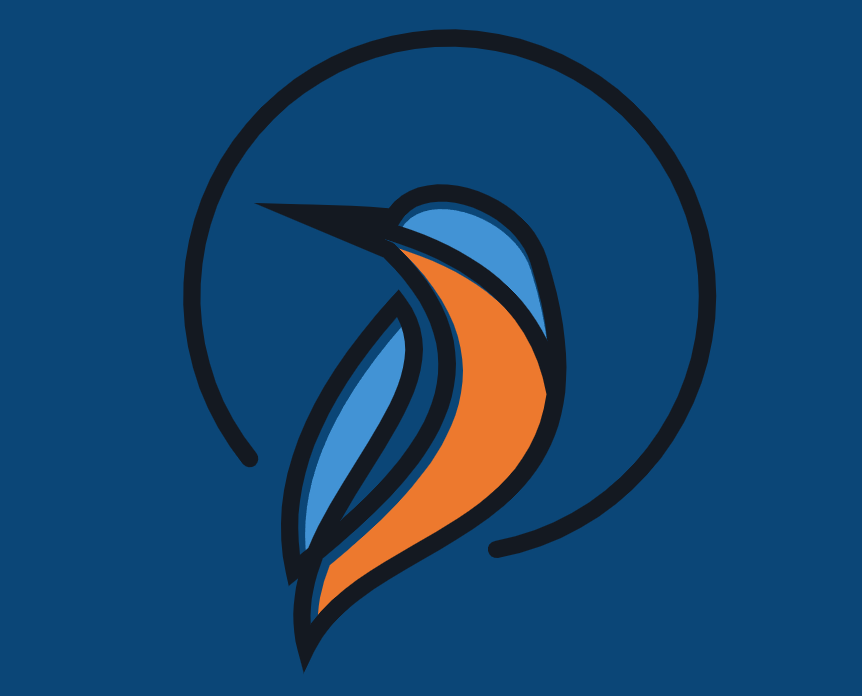
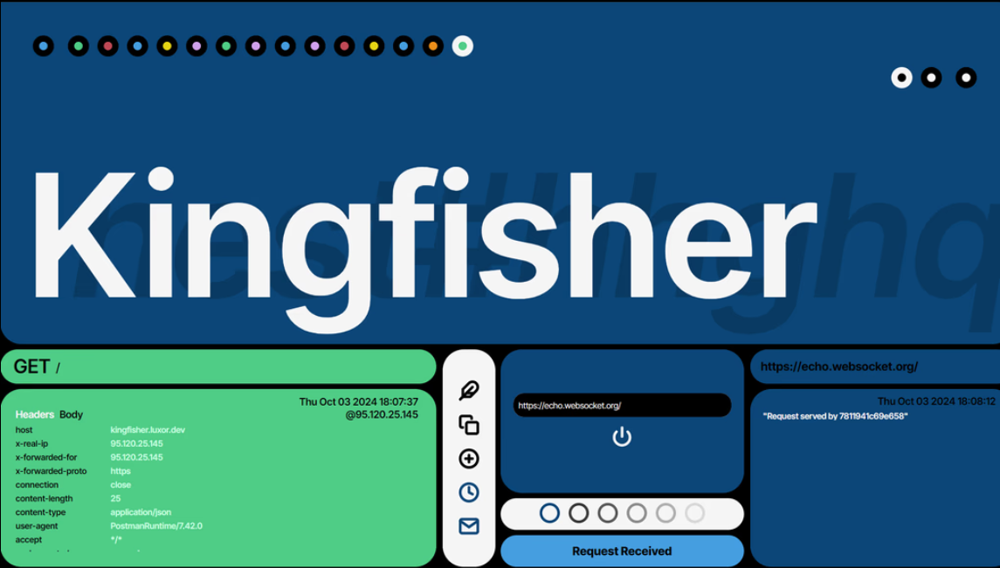

# Kingfisher



Kingfisher is a web service to inspect, test and debug APIs, webhooks and HTTP requests, with a minimalist, colorful UI. It also provides a channel for custom Websocket connections testing and debugging.

You can see a live demo [here](https://luxor.dev/kingfisher).

## Usage and UI



Each endpoint is called a **nest**, and is represented by a URL with the format:

```txt
http://kingfisher.luxor.dev/!/[nest id]
```

where [nest id] is a unique alphanumeric string, like, i.e.: 5KK7yyp7QFvRHVpvEQZ8f1. This is a compressed form for a valid UUID.

You can use a nest to receive any kind of HTTP request, API call or test Webhooks functionality. Each nest creates a Websocket client connected to the Kingfisher server, so, when the Kingfisher backend receives a request, it can send a message to the nest client. This way, the DOM in the frontend app is updated on real time, and a colored circle appears on the left side.

Besides that, we can establish a connection between the nest and any Websocket server. In the backend, the Kingfisher server will create a custom client connected to that server. From the other hand, a new, additional Websocket connection will be established between the Kingfisher backend and the frontend, so the DOM on the frontend's side is updated on real time when the external Websocket servers sends a message.

The UI is comprised by two main elements:

- On the left side of the top part you will see incoming requests, in order of arrival, represented by colored circles, in which each color corresponds with an HTTP method. When you click on a request, you will see its details on the bottom left panel (date of arrival, headers, path, etc.). On the right side you will see the incoming Websocket messages if there is an active Websocket connection; if you click on it, the date of arrival and the message's content will be displayed on the bottom right panel.

- The bottom element contains the main controls panel and the Websocket connection panel, besides the left and rightmost panels already described, with the requests and messages details. Each icon represents a function (each icon is described when you hover the mouse over it):

    
    - The feather performs a test request to the server using a random HTTP method.
    - The two squares copy the current nest URL to the clipboard
    - The plus sign generates a new nest
    - The clock displays a panel with the last 6 nests generated, from the more recent to the oldest.
    - The envelope opens the custom Websocket connection panel.

## How to test it locally

### Requirements

You will need:

- Docker
- Node.js, v20.8.0

### Instructions

Once you've cloned the repo, go to the `db` folder and run:

```sh
docker compose up --detached
```

In the `backend` server, run:

```sh
npm install
```

Once the dependencies have been installed, run this to start the server:

```sh
npm run start:dev
```

On another terminal, go to the `frontend` folder and run:

```sh
npm run dev
```

Then, visit <http://localhost:5173/kingfisher>.